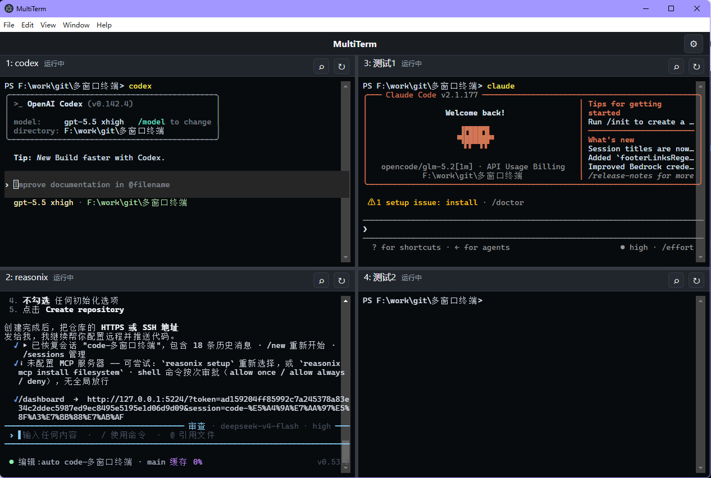
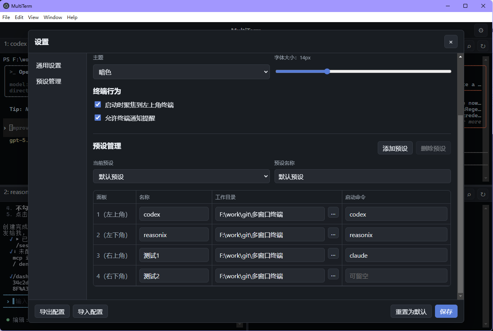

# MultiTerm

MultiTerm 是一个基于 Electron、React、TypeScript、xterm.js 和 node-pty 的多窗口终端 Demo，目标是更方便地一键启动开发项目，并提供适合 vibe coding 的 CLI 操作界面。

> 当前项目处于 Demo 阶段，适合用于功能验证、技术选型和二次开发起点；还不是面向生产发布的稳定版本。

## 界面预览





## 功能概览

- 默认四个独立终端窗口，采用 2x2 布局
- 每个终端拥有独立 shell 会话、工作目录、输入输出和滚动区域
- 支持拖拽调整四分屏横向/纵向分割线
- 支持设置弹窗，包括启动行为、主题、字体大小和终端行为
- 支持多预设管理，可配置每个终端的名称、工作目录和启动命令
- 支持配置持久化、导入和导出
- 支持终端搜索、复制粘贴、重启单个终端
- 支持 Windows 安装包打包

## 技术栈

- Electron
- React
- TypeScript
- xterm.js
- node-pty
- electron-vite
- electron-builder

## 开发启动

```powershell
npm install
npm run dev
```

开发窗口会由 Electron 自动打开。

## 编译

```powershell
npm run build
```

编译产物输出到 `out/`。

## 打包 Windows exe

```powershell
npm run dist:win
```

打包完成后产物位于：

```text
dist/MultiTerm Setup 0.1.0.exe
dist/win-unpacked/MultiTerm.exe
```

## Demo 限制

- 当前未配置应用图标和代码签名
- 当前每个面板只维护一个终端会话，尚未实现单面板多标签页
- 预设和配置结构已可用，但还未做复杂校验和迁移版本管理
- Windows 打包关闭了 native rebuild，使用 node-pty 自带预编译文件
- UI 仍以 Demo 可用性为主，后续可继续打磨细节和无障碍体验

## 项目结构

```text
src/main/       Electron 主进程，负责窗口、配置和 node-pty
src/preload/    安全暴露给渲染进程的 IPC API
src/renderer/   React UI 和 xterm.js 终端界面
src/shared.ts   主进程和渲染进程共用类型与默认配置
```

## 常用命令

```powershell
npm run test      # 配置归一化自检
npm run build     # TypeScript 检查并编译
npm run dev       # 启动开发窗口
npm run dist:win  # 生成 Windows 安装包
```
